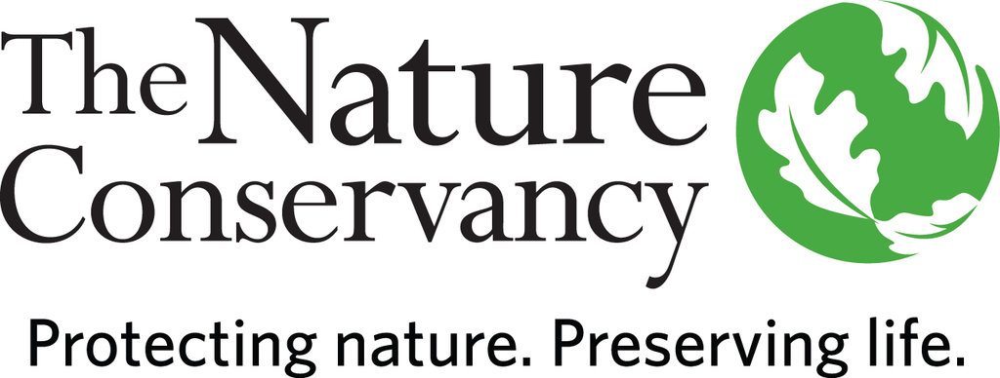
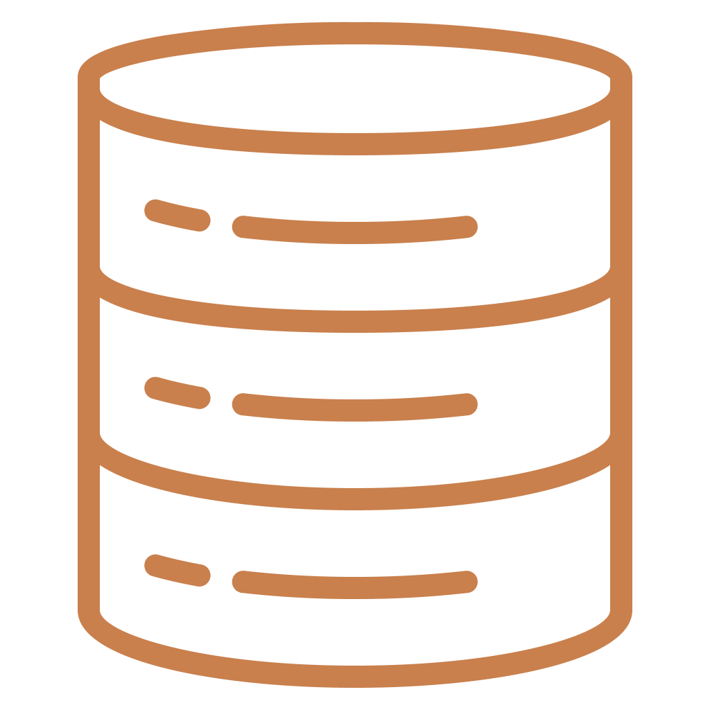

## Sponsored by The Nature Conservancy - Oregon Chapter

###	The Oregon Nature Conservancy needs better data management to protect nature.

The Oregon Chapter of The Nature Conservancy does important work in conservation, land management and public outreach. With such broad interests, the Nature Conservancy accumulates terabytes of data a year in documents, GIS and promotional resources. This mass of data has been accumulating over the years creating unnecessary disorganization and unproductivity within the branch. Our agenda is to streamline their data organization to help improve efficiency and protect nature.

## Solution

### Box Optimization

TNC Oregon already uses BOX for many of their collaborative works. We want to encourage the use of cloud storage. We also want to make sure that everyone knows (generally) where everything is. That’s why our solution is to move everything that is important in the Network drives onto BOX folders that are carefully selected to represent the functional groups within TNC Oregon. The remainder of the contents on the Network drives will remain there in cold storage.

{:height="80"}

### Workspaces
As part of this concerted move to BOX, we want to define functional groups within TNC Oregon that will allow us to know exactly where the important data in the network drives are, as well as the data that already exists within BOX, will go. Our goal is to let TNC define how they best want to organize the data within those functional groups, rather than try to force something upon them.

* Individual Workspaces
  * One directory for each user containing their own work and their own data
* Shared Workspaces
  * Intended for data that is relevant to other functional groups, a way for chapter to easily share data amongst themselves
* Functional Groups
  * One directory for each functional group, intended only for people relevant to the work, potentially sensitive data
* Archive
  * For old data that is no longer needed by TNC, but needs to be retained

{:height="80"}

### Permissions
Permissions follow a waterfall design, where any permission rule applied to a folder will also apply to any documents/folders under that document. Therefore, it is important to set permissions as narrowly as possible at the highest level folder.
The default permission level is Editor, which has far more functionality that is usually needed. Don’t always default to Editor, think about what you want the user to be able to do

### Best Practices

* Regular Cleaning
  * Every department needs a Curator responsible for maintaining the data hygine of a department.
* The organization as a whole should agree upon a shared set of rules and norms for naming their files.
* Transitioning to a fully online data ecosystem is 1% technology, 99% behavioral. Training sessions should be performed so that TNC employees are comfortable with the new information environment.

{:height="80"}

### Team

Name | Username | Email
-----|----------|------
Brandon Chong | [bch0ng](https://www.github.com/bch0ng) | [bchong@uw.edu](mailto:bchong@uw.edu)
Sean Mahoney |[smm42](https://www.github.com/smm42) | [smm42@uw.edu](mailto:smm42@uw.edu)
Linley Porter |[lporter515](https://www.github.com/lporter515) | [lport26@uw.edu](mailto:lport26@uw.edu)
Leon Tan | [lleontan](https://www.github.com/lleontan) | [lleontan@gmail.com](mailto:lleontan@gmail.com)

### Sponsor Info

Name | Email
-----|------
Michael Schindel | [mschindel@tnc.org ](mailto:mschindel@tnc.org )

#### About

This project is part of the capstone project course at the [University of Washington Information School](https://ischool.uw.edu/capstone).
